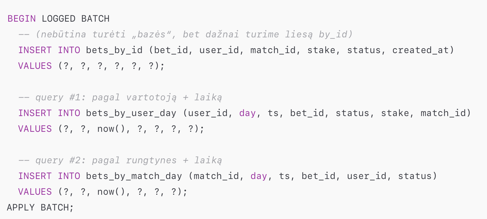

# 📚 Sportbook duomenų bazė (Cassandra) – pilna instrukcija

Šis dokumentas aprašo visą procesą nuo tuščio Docker Cassandra konteinerio iki pilnai užpildytos `sportsbook` duomenų bazės su visomis lentelėmis ir duomenimis.

---

## 1️⃣ Cassandra paleidimas per Docker

### Pirmas paleidimas (instaliacija + startas)
```bash
docker run -d --name cassandra -p 9042:9042 cassandra:latest
```

### Vėliau
```bash
docker stop cassandra
docker start cassandra
```


---

## 3️⃣ `.cql` failų paleidimas konteineryje

### Įkelti `.cql` failą
```bash
docker cp CASSANDRA/create_keyspace.cql cassandra:/create_keyspace.cq
```

### Paleisti `.cql` failą
```bash
docker exec -it cassandra cqlsh -f /create_keyspace.cql
```

---

## 4️⃣ Pagrindinės lentelės
### Pagrindinių lentelių `.cql` failai
```
old_data_schema.cql
teams.cql
users.cql
team_players.cql
team_coaches.cql
matches.cql
bets.cql
```

### Kopijavimas į konteinerį
```bash
docker cp CASSANDRA/old_data_schema.cql cassandra:/old_data_schema.cql
docker cp CASSANDRA/teams.cql cassandra:/teams.cql
docker cp CASSANDRA/users.cql cassandra:/users.cql
docker cp CASSANDRA/team_players.cql cassandra:/team_players.cql
docker cp CASSANDRA/team_coaches.cql cassandra:/team_coaches.cql
docker cp CASSANDRA/matches.cql cassandra:/matches.cql
docker cp CASSANDRA/bets.cql cassandra:/bets.cql
```

### Paleidimas
```bash
docker exec -it cassandra cqlsh -f /old_data_schema.cql
docker exec -it cassandra cqlsh -f /teams.cql
docker exec -it cassandra cqlsh -f /users.cql
docker exec -it cassandra cqlsh -f /team_players.cql
docker exec -it cassandra cqlsh -f /team_coaches.cql
docker exec -it cassandra cqlsh -f /matches.cql
docker exec -it cassandra cqlsh -f /bets.cql
```

---


## !!! Prisijungimas prie `cqlsh`

```bash
docker exec -it cassandra cqlsh
```

```bash
USE sportsbook;
```
```bash
DESCRIBE TABLES;
```
Išeiti:
```
EXIT;
```
---

## 5️⃣ Denormalizuotos lentelės
### **Šitą darome su įjungtų cqlsh:sportsbook> !!!**
### 5.1 `bets_by_user`
```sql
USE sportsbook;

CREATE TABLE IF NOT EXISTS bets_by_user (
  user_id text,
  event_date date,
  bet_created_at timestamp,
  bet_id text,
  user_email text,
  event_team1 text,
  event_team2 text,
  event_type text,
  bet_choice text,
  bet_team text,
  bet_score_team1 int,
  bet_score_team2 int,
  stake decimal,
  status text,
  created_at timestamp,
  PRIMARY KEY ((user_id), event_date, bet_created_at, bet_id)
) WITH CLUSTERING ORDER BY (event_date DESC, bet_created_at DESC, bet_id ASC);
```
 
#### Užpildymas
```sql
COPY bets (
  user_id, event_date, bet_created_at, bet_id,
  user_email, event_team1, event_team2, event_type,
  bet_choice, bet_team, bet_score_team1, bet_score_team2,
  stake, status, created_at
) TO 'bets_tmp.csv' WITH HEADER=TRUE;

COPY bets_by_user (
  user_id, event_date, bet_created_at, bet_id,
  user_email, event_team1, event_team2, event_type,
  bet_choice, bet_team, bet_score_team1, bet_score_team2,
  stake, status, created_at
) FROM 'bets_tmp.csv' WITH HEADER=TRUE;
```
ARBA GALIMA SU INSERT INTO (), bet čia vėliau ir labiau reikia kur messages
arba testavimo failai.

---

### 5.2 `bets_by_user_day`
```sql
USE sportsbook;

CREATE TABLE IF NOT EXISTS bets_by_user_day (
  user_id text,
  event_date date,
  bet_created_at timestamp,
  bet_id text,
  user_email text,
  event_team1 text,
  event_team2 text,
  event_type text,
  bet_choice text,
  bet_team text,
  bet_score_team1 int,
  bet_score_team2 int,
  stake decimal,
  status text,
  created_at timestamp,
  PRIMARY KEY ((user_id, event_date), bet_created_at, bet_id)
) WITH CLUSTERING ORDER BY (bet_created_at DESC, bet_id ASC);
```

#### Užpildymas
```sql
COPY bets_by_user (
  user_id, event_date, bet_created_at, bet_id,
  user_email, event_team1, event_team2, event_type,
  bet_choice, bet_team, bet_score_team1, bet_score_team2,
  stake, status, created_at
) TO 'bets_by_user_day_tmp.csv' WITH HEADER=TRUE;

COPY bets_by_user_day (
  user_id, event_date, bet_created_at, bet_id,
  user_email, event_team1, event_team2, event_type,
  bet_choice, bet_team, bet_score_team1, bet_score_team2,
  stake, status, created_at
) FROM 'bets_by_user_day_tmp.csv' WITH HEADER=TRUE;
```

---

### 5.3 `bets_by_match`
```sql
USE sportsbook;

CREATE TABLE IF NOT EXISTS bets_by_match (
  event_type text,
  event_date date,
  event_team1 text,
  event_team2 text,
  bet_created_at timestamp,
  bet_id text,
  user_id text,
  user_email text,
  bet_choice text,
  bet_team text,
  bet_score_team1 int,
  bet_score_team2 int,
  stake decimal,
  status text,
  created_at timestamp,
  PRIMARY KEY (
    (event_type, event_date, event_team1, event_team2),
    bet_created_at, bet_id
  )
) WITH CLUSTERING ORDER BY (bet_created_at DESC, bet_id ASC);
```

#### Užpildymas
```sql
COPY bets (
  event_type, event_date, event_team1, event_team2,
  bet_created_at, bet_id,
  user_id, user_email, bet_choice, bet_team, bet_score_team1, bet_score_team2,
  stake, status, created_at
) TO 'bets_by_match_tmp.csv' WITH HEADER=TRUE;

COPY bets_by_match (
  event_type, event_date, event_team1, event_team2,
  bet_created_at, bet_id,
  user_id, user_email, bet_choice, bet_team, bet_score_team1, bet_score_team2,
  stake, status, created_at
) FROM 'bets_by_match_tmp.csv' WITH HEADER=TRUE;
```

---

## 6️⃣ Patikrinimas

```sql
DESCRIBE KEYSPACES;
DESCRIBE TABLES IN sportsbook;
SELECT COUNT(*) FROM bets;
SELECT * FROM bets_by_user LIMIT 5;
SELECT * FROM bets_by_user_day LIMIT 5;
SELECT * FROM bets_by_match LIMIT 5;
```

---

## 7️⃣ Pilnas reset (jei reikia pradėti iš naujo)

```bash
docker stop cassandra
docker rm cassandra
docker volume prune -f
```

---

## 🧾 Naudingi špargalkės

| Veiksmas | Komanda |
|----------|---------|
| Prisijungti prie DB | `docker exec -it cassandra cqlsh` |
| Įkelti `.cql` failą | `docker cp failas.cql cassandra:/failas.cql` |
| Paleisti `.cql` failą | `docker exec -it cassandra cqlsh -f /failas.cql` |
| Restart DB | `docker restart cassandra` |
| Tikrinti logus | `docker logs cassandra --tail 50` |

---

## Lentelių paskirtys

| Lentelė | Paskirtis |
|---------|-----------|
| bets | originalūs Mongo duomenys |
| bets_by_user | visų laikų statymai pagal user |
| bets_by_user_day | statymai 1 dienos tikslumu |
| bets_by_match | statymai pagal rungtynes |

---

